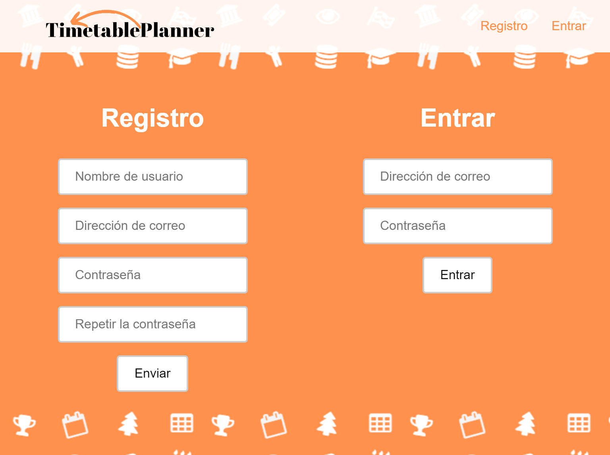
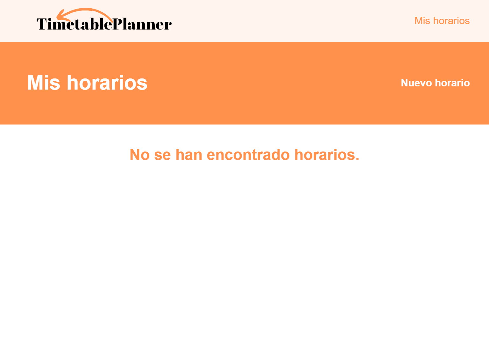
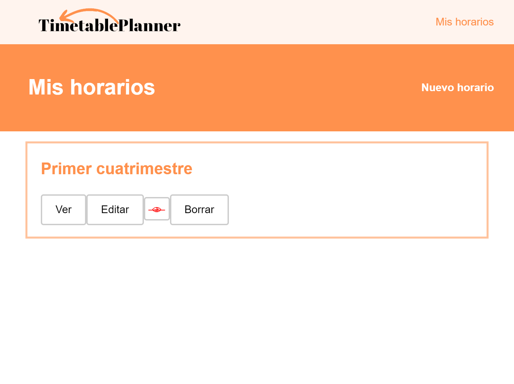
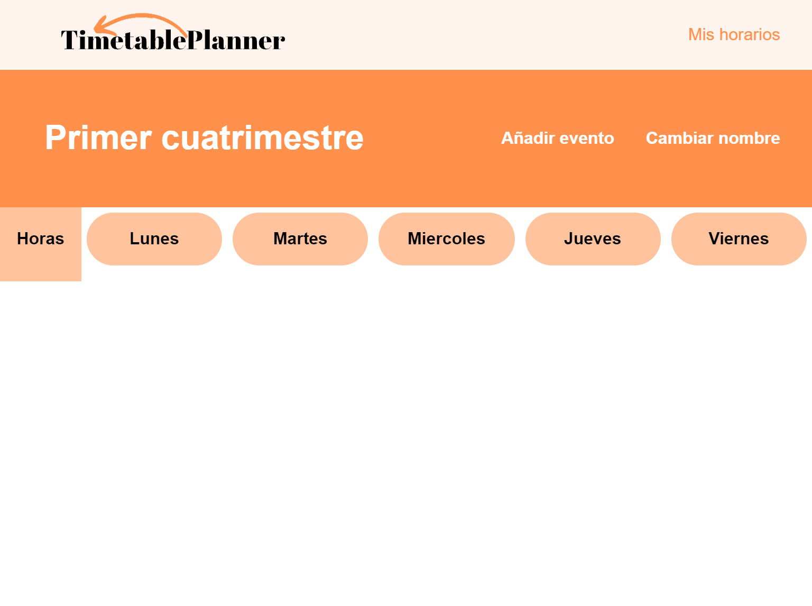
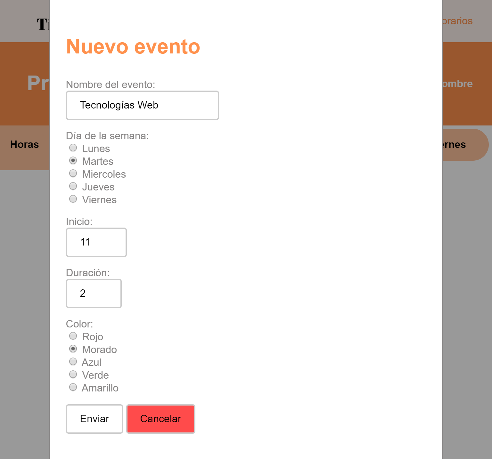
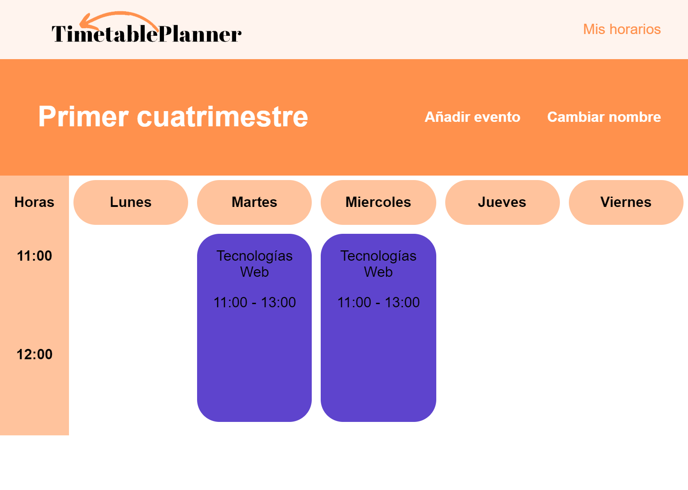
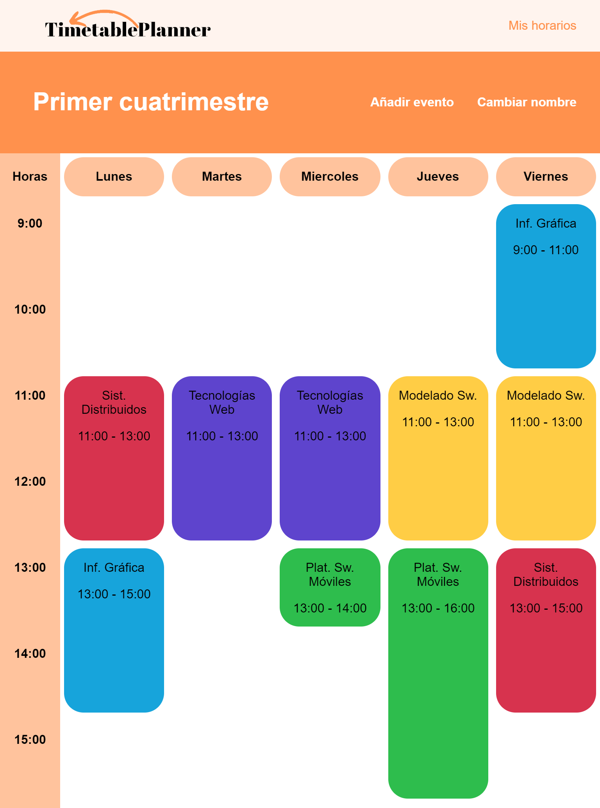
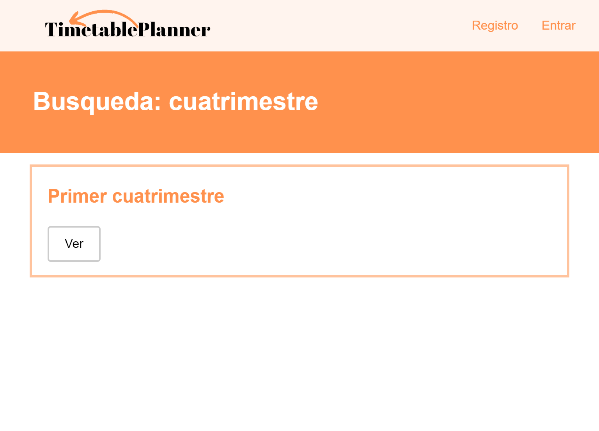

# TimetablePlanner

**Proyecto Tecnologías Web** - Francisco de la Puente

## Índice

1. **Despliegue sobre un servidor local**
2. **Organización de ficheros**
3. **Uso de aplicación**

## Despliegue sobre un servidor local

En mi caso, he realizado la práctica sobre un servidor local, por lo que explicaré como instalar la aplicación en uno.

1. El primer paso es tener descargado un servidor local. En mi caso he usado **XAMPP**.
2. Hay que introducir todos los ficheros fuente en la carpeta que maneja el servidor. En caso de XAMPP, la carpeta es **htdocs**, encontrada en el directorio de instalación del propio XAMPP. Es recomendable agrupar todos los archivos bajo una misma carpeta.
3. Lo siguiente será abrir XAMPP y arrancar los módulos *Apache* y *MySQL*, para poder hacer uso del servidor y del administrador de bases de datos.
4. Por último, hay que importar el fichero de la carpeta *sql*, que contiene la estructura de la base de datos y algunos datos que introduciremos en esta memoria.

La aplicación ya está instalada y se puede abrir en la dirección ***localhost/\<nombre del directorio\>/index.php***.

## Organización de ficheros

La estructura de la aplicación es la siguiente:

- En la carpeta principal se encuentran los archivos .php principales.
    - **index.php** es la página principal.
    - **busqueda.php** muestra distintos horarios según la consulta que se haga.
    - **horario.php** muestra el horario que se le indica, distinguiendo entre modo edición y solo lectura.
    - **login.php** gestiona el inicio de sesión.
    - **cerrar_sesion.php** gestiona el cierre de sesión.
- En la carpeta *css* se encuentra un único archivo de estilo. Decidí que todos los estilos estuvieran en el mismo .css para reutilizar fácilmente estilos entre distintas páginas.
- En la carpeta *js* se encuentran los diferentes scripts JavaScript usados.
    - Uno de ellos es **JQuery**, usado en parte de la práctica. Como no vimos JQuery hasta después de la entrega parcial, hay partes de los scripts que no lo usan.
    - **regexps.js** agrupa todas las expresiones regulares usadas, también por reutilización.
    - De los otros 3 scripts: **leerformularios.js** se encarga de la página de inicio, **busquedas.js** de la página de busqueda y **generadorhorarios.js** de la página de los horarios.
- La carpeta *php* contiene todos los archivos que realizan una comunicación con la base de datos.
    - **conexion.php** contiene la información necesaria para conectarse a la base de datos. **Es importante cambiarlo para que la aplicación funcione.**
    - **borrar_horario.php** borra un horario según su Id.
    - **buscar_horarios.php** busca una cadena entre los nombres de los diferentes horarios visibles.
    - **cambiar_nombre.php** cambia el nombre de un horario.
    - **cambiar_visualizacion.php** cambia la visualización de un horario entre público y privado.
    - **comprobar_pertenencia.php** comprueba si un horario pertenece a un usuario.
    - **entrar_usuario.php** comprueba si un conjunto correo-contraseña se encuentra registrado en la base de datos.
    - **nombre_horario.php** devuelve el nombre de un horario según su Id.
    - **nuevo_evento.php** inserta un nuevo evento a la base de datos.
    - **nuevo_horario.php** añade un nuevo horario.
    - obtener_horario.php recupera todos los eventos de un horario.
    - **quitar_evento.php** elimina un evento de la base de datos.
    - **recuperar_horarios.php** devuelve los horarios de un usuario.
    - **registro_usuario.php** registra un nuevo usuario.
- En la carpeta *sql* está el fichero de importación de la base de datos.
- En la carpeta *src* se encuentran distintos recursos usados en la aplicación.

## Uso de la aplicación

Vamos a usar todas las funcionalidades de la aplicación. Lo primero será abrir la página y ir a la sección de registro.

> Imagen 1. Sección de registro y login.

Al lazo izquierdo vemos el formulario de registro. Como indica el caso de uso del registro, aquí se puede registrar con una dirección de correo y una contraseña. Además, he añadido un nombre de usuario y el típico campo de repetición de la contraseña.

Al lado derecho se encuentra el formulario de login, que como dice el caso de uso, cuenta con los campos de dirección de correo y contraseña.

Para el registro utilizaré el nombre de usuario "*francisco*", la dirección de correo "*francisco.puente@alumnos.uva.es*" y la contraseña "*contraseña*". Una vez registrado, el sistema entra directamente en la cuenta.

Ahora nos dirigiremos a nuestros horarios. Para acceder, se pulsa el botón de "Mis horarios", donde antes se encontraban los enlaces de registro y login.

> Imagen 2. Mis horarios

Acabamos de crear la cuenta, por lo que no hay ningún horario creado. Para crearlo hay que pulsar el botón de "Nuevo horario". Esto abrirá un prompt para indicar el nombre del nuevo horario. En este caso, crearemos el horario "Primer cuatrimestre".

> Imagen 3. Horario creado

Al crear un horario, la página se recarga, lo que hace que se muestre el nuevo horario creado. Este presenta varias opciones: ver, editar, cambiar visualización y borrar.

En primer lugar, veremos la opción de editar.

> Imagen 4. Horario vacío en edición

Al haber sido recien creado, no incluye ningún evento, por lo que se encuentra vacío. Vamos a añadir 2 eventos, que serán las dos clases semanales que hay de "Tecnologías Web" los martes y miércoles de 11 a 13. Para ello, pulsaremos en "Añadir evento".

> Imagen 5. Introducción de nuevo evento

En este formulario se puede indicar el nombre de un evento, el día de la semana en que ocurre, la hora de inicio (de 0 a 23), la duración (máximo 8 horas) y un color identificativo.

> Imagen 6. Horario con dos tareas introducidas

Como se ve en la imagen, el horario se va generando a medida que se crean nuevos eventos. Ahora, terminaré de introducir todas las demás horas de clase del primer cuatrimestre de 3º.

> Imagen 7. Horario creado por completo

Como parte del caso de uso de modificación del horario, falta explicar como se elimina un evento. Esto se hace pulsando sobre el evento que se quiere eliminar. El navegador creará un dialogo de confirmación para evitar equivocaciones.

Además, una funcionalidad que en el enunciado no está fijada y he implementado es la posibilidad de cambiar el nombre del horario. Al pulsar en el botón de "Cambiar nombre", el navegador abrirá un prompt que preguntará por el nuevo nombre, y si es válido lo actualizará.

Si volvemos a la página de "Mis horarios", tenemos otras tres opciones. La opción "Ver" permitirá ver el horario sin las herramientas de edición. El ojo permite cambiar la visualización entre pública o privada. Por defecto es privada (ojo tachado rojo). Al pulsar, el horario pasa a ser público (ojo sin tachar negro). La última opción es "Borrar", que permitirá borrar un horario entero, pidiendo antes una confirmación.

Vamos a volver ahora a la página principal para terminar con el último caso de uso: "Visualizar horario publicado". Esto se puede hacer desde un buscador.

> Imagen 8. Buscador de horarios

Este buscador devolverá en la página de busqueda los distintos horarios **públicos** que contengan o coincidan con la consulta del usuario. Funciona tanto para usuarios registrados como para no registrados. Por ello, vamos a bajar un poco en esa página hasta la opción de cerrar sesión.

> Imagen 9. Opción de cerrar sesión

Después de cerrar sesión, vamos a intentar buscar el horario que creamos y públicamos anteriormente. Introduciremos entonces la palabra "*cuatrimestre*", aunque también podríamos poner el nombre completo.

> Imagen 10. Busqueda de "cuatrimestre"

Como vemos, la busqueda devuelve correctamente los horarios que contienen la palabra buscada (no importan las mayúsculas) y nos dejan visualizar el horario aunque no estemos registrados.

Para finalizar, las páginas de busqueda y horario están protegidas para que en caso de intentar hacer una acción no permitida, redirija a la página de inicio (como por ejemplo, editar un horario que no es del usuario).